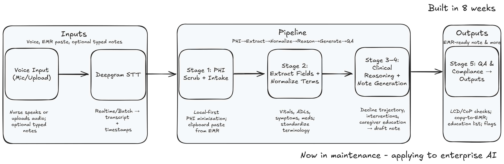

# NurseCharts | Architecture Teardown (Maintenance-Mode)

**Problem →** Hospice documentation is time-intensive and cognitively heavy.  
**Goal →** Convert voice + EMR paste into Medicare-compliant notes with QA signals and copy-to-EMR output.  
**Status →** Maintenance-mode; applying learnings to team workflows (agentic pipelines + evals).



## Architecture at a glance

1. **Voice Input (Mic/Upload)** → nurse speaks or uploads audio; optional typed notes.
2. **Deepgram STT** → transcript with timestamps.
3. **Stage 1: PHI Scrub + Intake** → local-first minimization; EMR paste support.
4. **Stage 2: Extract & Normalize** → vitals, ADLs, meds, symptoms; standardized terms.
5. **Stage 3–4: Clinical Reasoning + Note Generation** → decline trajectory, interventions, caregiver education → draft narrative.
6. **Stage 5: QA & Compliance → Outputs** → LCD/CoP checks, consistency passes, copy-to-EMR; also export education topics, interventions, and risk flags.

## Tech Stack (representative)

- Next.js + TypeScript (UI), Deepgram (STT), prompt-engineered generation
- Local-first PHI minimization; ephemeral processing where possible
- Clipboard-friendly output for HospiceMD

## RAG Evaluation Results (Sept 2024)

Built eval harness after realizing I had no hallucination checks. Testing 10 healthcare cases:

| Metric | Current | Target | Status |
|--------|---------|--------|--------|
| **Faithfulness** | 0.72 | ≥0.85 | Needs work |
| **Context Precision** | 0.74 | ≥0.80 | Close |
| **Answer Relevance** | 0.68 | ≥0.85 | Needs work |
| **Latency (p50)** | 680ms | ≤800ms | Met |

Medicare compliance subset: 0.65 faithfulness (critical gap).

See [eval/](./eval) for test cases and methodology. Running mock RAG currently - real retrieval pipeline next.

## Limits & Lessons

- **Limits:** Not a medical device; outputs require clinician review; model hallucinations measured at 28% (working to reduce).
- **Privacy:** Do not store PHI; minimize scope; prefer browser-side processing.
- **Operational:** Fast to demo; real-world requires evals + governance + change management.

## Next

- ✅ ~~Publish eval harness~~ → Done, 0.72 baseline
- Wire real retrieval pipeline → target 0.85+ faithfulness
- Agentic RFP responder prototype (single section with citations)
- Weekly updates: measure → improve → ship

## Running the Eval

```bash
npm install js-yaml
node eval/run_eval.js
